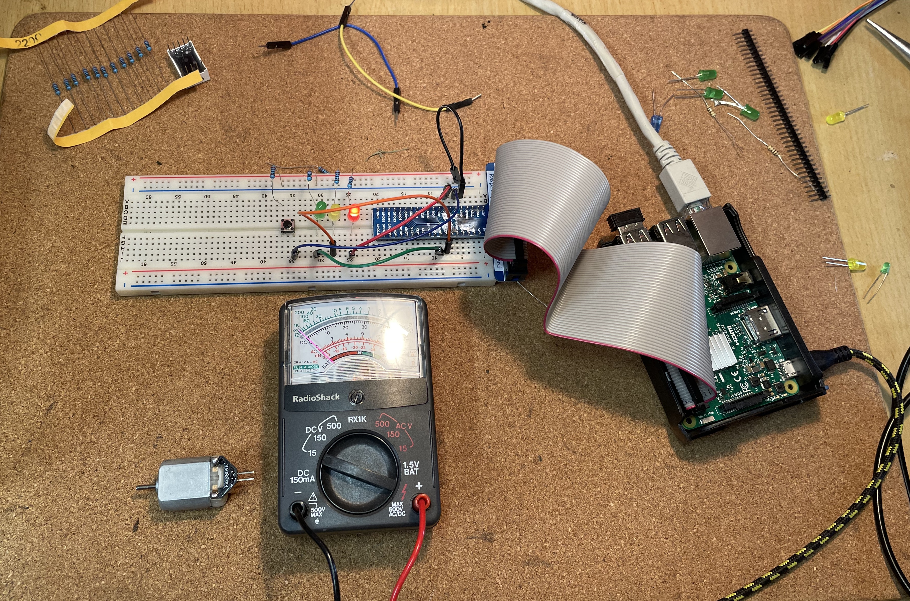

# raspberrypi-trafficlights

Basic Python code to run traffic light example.  Turn off your pi when plugging in electronics :)

Pin Layout:
- RED + of LED to GPIO 22
- AMBER + of LED to GPIO 23
- GREEN + of LED to GPIO 24
- SWITCH ( same side as the +'s on the LEDS ) to GPIO 17

Ground ( GPIO Pin 9 ) to rail

Resitors from rail to - side of LED's and switch ( note swtich is niether + or - just ensure the wires are on the oposite side )

Resisitors are 220 Ω but 1000Ω ( 1kΩ ) would be just as good, perhaps a little dimmer what ever you have lying around is fine antull the resistance is too high and the LED wont turn on.

Parts list:
- 220Ω resistor
- LED Diods
- Small Switch
- Breadboard
- Wires

https://www.ebay.com.au/itm/393358382789

 ( Click to watch )

Twitch Video Link:  https://www.twitch.tv/aws/video/1057605531